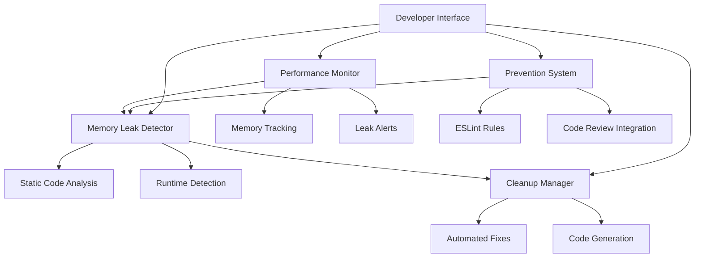

# Design Document

## Overview

The Memory Leak Detection and Fixing system is designed to identify, analyze, and automatically resolve memory leaks in the UnifiedHQ Next.js application. The system consists of multiple components working together to provide comprehensive memory leak detection, automated fixes, real-time monitoring, and prevention mechanisms.

Based on the codebase analysis, the application has several potential memory leak sources:
- EventSource connections in activity feeds
- Event listeners in accessibility hooks and mobile detection
- Intervals and timeouts in authentication and performance monitoring
- Subscription patterns in auth client and toast management
- React hooks with missing cleanup functions

## Architecture

The system follows a modular architecture with four main components:



## Components and Interfaces

### 1. Memory Leak Detector

**Purpose**: Scans code and runtime for memory leak patterns

**Core Interfaces**:
```typescript
interface MemoryLeakDetector {
  scanFile(filePath: string): Promise<LeakReport[]>;
  scanProject(): Promise<ProjectLeakReport>;
  analyzeRuntime(): Promise<RuntimeLeakReport>;
  validateFixes(fixes: Fix[]): Promise<ValidationResult>;
}

interface LeakReport {
  type: LeakType;
  severity: 'low' | 'medium' | 'high' | 'critical';
  file: string;
  line: number;
  column: number;
  description: string;
  suggestedFix?: string;
  codeSnippet: string;
}

type LeakType = 
  | 'missing-useeffect-cleanup'
  | 'uncleaned-event-listener'
  | 'uncleaned-interval'
  | 'uncleaned-timeout'
  | 'uncleaned-subscription'
  | 'unclosed-eventsource'
  | 'unclosed-websocket'
  | 'memory-accumulation'
  | 'circular-reference';
```

**Detection Patterns**:
- **useEffect without cleanup**: Detects useEffect hooks that add event listeners, intervals, or subscriptions without cleanup
- **Event listeners**: Identifies addEventListener calls without corresponding removeEventListener
- **Intervals/Timeouts**: Finds setInterval/setTimeout without clearInterval/clearTimeout
- **EventSource/WebSocket**: Detects connections without proper close() calls
- **Subscriptions**: Identifies subscription patterns without unsubscribe mechanisms

### 2. Cleanup Manager

**Purpose**: Automatically generates and applies fixes for detected memory leaks

**Core Interfaces**:
```typescript
interface CleanupManager {
  generateFix(leak: LeakReport): Promise<Fix>;
  applyFix(fix: Fix): Promise<ApplyResult>;
  batchApplyFixes(fixes: Fix[]): Promise<BatchApplyResult>;
  previewFix(fix: Fix): string;
}

interface Fix {
  id: string;
  type: LeakType;
  file: string;
  originalCode: string;
  fixedCode: string;
  description: string;
  confidence: number; // 0-1
  requiresManualReview: boolean;
}
```

**Fix Strategies**:
- **useEffect cleanup**: Add return statements with cleanup functions
- **Event listener cleanup**: Add removeEventListener in cleanup
- **Interval cleanup**: Add clearInterval/clearTimeout in cleanup
- **Connection cleanup**: Add close() calls for EventSource/WebSocket
- **Subscription cleanup**: Add unsubscribe patterns

### 3. Enhanced Performance Monitor

**Purpose**: Extends existing performance monitoring with memory leak detection

**Core Interfaces**:
```typescript
interface MemoryPerformanceMonitor extends PerformanceMonitor {
  trackMemoryLeaks(): void;
  getMemoryMetrics(): MemoryMetrics;
  detectMemoryTrends(): MemoryTrend[];
  alertOnMemoryThreshold(threshold: number): void;
}

interface MemoryMetrics {
  heapUsed: number;
  heapTotal: number;
  external: number;
  arrayBuffers: number;
  gcFrequency: number;
  memoryGrowthRate: number;
  suspiciousGrowth: boolean;
}

interface MemoryTrend {
  timestamp: Date;
  memoryUsage: number;
  componentCount: number;
  eventListenerCount: number;
  intervalCount: number;
  trend: 'stable' | 'growing' | 'declining';
}
```

**Integration Points**:
- Extends existing `usePerformanceMonitor` hook
- Integrates with existing `useMemoryLeakDetection` hook
- Adds memory tracking to existing performance metrics

### 4. Prevention System

**Purpose**: Prevents future memory leaks through linting and code review integration

**Core Interfaces**:
```typescript
interface PreventionSystem {
  createESLintRules(): ESLintRule[];
  validatePullRequest(prData: PullRequestData): Promise<ValidationResult>;
  generateBestPracticesGuide(): BestPracticesGuide;
  setupPreCommitHooks(): void;
}

interface ESLintRule {
  name: string;
  description: string;
  category: 'error' | 'warning';
  fixable: boolean;
  rule: (context: ESLintContext) => ESLintVisitor;
}
```

## Data Models

### Memory Leak Registry
```typescript
interface MemoryLeakRegistry {
  leaks: Map<string, LeakReport>;
  fixes: Map<string, Fix>;
  history: LeakHistoryEntry[];
  statistics: LeakStatistics;
}

interface LeakHistoryEntry {
  timestamp: Date;
  action: 'detected' | 'fixed' | 'ignored';
  leak: LeakReport;
  fix?: Fix;
}

interface LeakStatistics {
  totalLeaksDetected: number;
  leaksFixed: number;
  leaksByType: Record<LeakType, number>;
  averageFixTime: number;
  preventedLeaks: number;
}
```

### Configuration Model
```typescript
interface MemoryLeakConfig {
  detection: {
    enableStaticAnalysis: boolean;
    enableRuntimeDetection: boolean;
    scanPatterns: string[];
    excludePatterns: string[];
    severity: LeakType[];
  };
  fixes: {
    autoApplyLowRisk: boolean;
    requireReviewForHighRisk: boolean;
    backupOriginalFiles: boolean;
    maxBatchSize: number;
  };
  monitoring: {
    memoryThreshold: number;
    alertFrequency: number;
    trackingInterval: number;
    retentionPeriod: number;
  };
  prevention: {
    enableESLintRules: boolean;
    enablePreCommitHooks: boolean;
    enablePRValidation: boolean;
    strictMode: boolean;
  };
}
```

## Error Handling

### Error Categories
1. **Detection Errors**: Issues during code scanning or runtime analysis
2. **Fix Application Errors**: Problems applying automated fixes
3. **Monitoring Errors**: Failures in memory tracking or alerting
4. **Configuration Errors**: Invalid settings or missing dependencies

### Error Recovery Strategies
```typescript
interface ErrorHandler {
  handleDetectionError(error: DetectionError): Promise<void>;
  handleFixError(error: FixError): Promise<void>;
  handleMonitoringError(error: MonitoringError): Promise<void>;
  recoverFromError(error: SystemError): Promise<RecoveryResult>;
}

interface RecoveryResult {
  success: boolean;
  fallbackAction?: string;
  userNotification?: string;
  logEntry: string;
}
```

### Graceful Degradation
- If static analysis fails, fall back to runtime detection only
- If automated fixes fail, provide manual fix suggestions
- If monitoring fails, continue with basic memory tracking
- Always preserve original code with backup mechanisms

## Testing Strategy

### Unit Testing
- **Detector Tests**: Verify detection of all leak patterns
- **Fix Generator Tests**: Ensure correct fix generation for each leak type
- **Monitor Tests**: Validate memory tracking and alerting
- **Integration Tests**: Test component interactions

### Memory Leak Testing
```typescript
interface MemoryLeakTestSuite {
  testLeakDetection(): Promise<TestResult>;
  testFixApplication(): Promise<TestResult>;
  testMemoryMonitoring(): Promise<TestResult>;
  testPreventionMechanisms(): Promise<TestResult>;
}

interface TestResult {
  passed: boolean;
  leaksDetected: number;
  leaksFixed: number;
  falsePositives: number;
  memoryUsageBefore: number;
  memoryUsageAfter: number;
  performanceImpact: number;
}
```

### Integration with Existing Testing
- Extend existing performance tests with memory leak detection
- Add memory leak tests to CI/CD pipeline
- Create memory usage benchmarks for regression testing
- Integrate with existing test utilities and mocks

## Performance Considerations

### Optimization Strategies
1. **Lazy Loading**: Load detection modules only when needed
2. **Caching**: Cache analysis results to avoid re-scanning unchanged files
3. **Incremental Analysis**: Only analyze changed files in development
4. **Background Processing**: Run heavy analysis tasks in background
5. **Memory Efficient**: Use streaming for large file analysis

### Resource Management
```typescript
interface ResourceManager {
  allocateDetectionWorker(): Worker;
  releaseDetectionWorker(worker: Worker): void;
  manageMemoryUsage(): void;
  optimizeAnalysisPerformance(): void;
}
```

### Performance Metrics
- Analysis time per file
- Memory usage during detection
- Fix application time
- Impact on development workflow
- Runtime monitoring overhead

## Security Considerations

### Code Safety
- Validate all code transformations before applying
- Sandbox fix application to prevent code injection
- Backup original files before applying fixes
- Verify fix integrity with checksums

### Data Privacy
- Anonymize code snippets in reports
- Secure storage of leak reports and statistics
- Encrypted transmission of monitoring data
- Compliance with data retention policies

### Access Control
```typescript
interface SecurityManager {
  validateFixPermissions(user: User, fix: Fix): boolean;
  auditFixApplication(fix: Fix, user: User): void;
  encryptSensitiveData(data: any): string;
  validateCodeIntegrity(code: string): boolean;
}
```

## Implementation Phases

### Phase 1: Core Detection (Week 1-2)
- Implement basic memory leak detection patterns
- Create leak report generation
- Set up project structure and configuration

### Phase 2: Automated Fixes (Week 3-4)
- Develop fix generation algorithms
- Implement safe code transformation
- Add fix preview and validation

### Phase 3: Enhanced Monitoring (Week 5-6)
- Extend existing performance monitoring
- Add real-time memory tracking
- Implement alerting system

### Phase 4: Prevention & Integration (Week 7-8)
- Create ESLint rules
- Integrate with code review process
- Add testing infrastructure
- Documentation and best practices

## Integration Points

### Existing Codebase Integration
- **Performance Monitor**: Extend `src/hooks/use-performance-monitor.ts`
- **Auth Client**: Fix subscription leaks in `src/lib/auth-client.ts`
- **Activity Feed**: Fix EventSource leaks in activity feed components
- **Accessibility Hooks**: Fix event listener leaks in `src/hooks/use-accessibility.tsx`

### Development Workflow Integration
- Pre-commit hooks for leak detection
- CI/CD pipeline integration
- Code review automation
- Developer dashboard for leak monitoring

### External Tool Integration
- ESLint plugin for leak prevention
- VS Code extension for real-time detection
- GitHub Actions for automated PR checks
- Monitoring dashboard integration