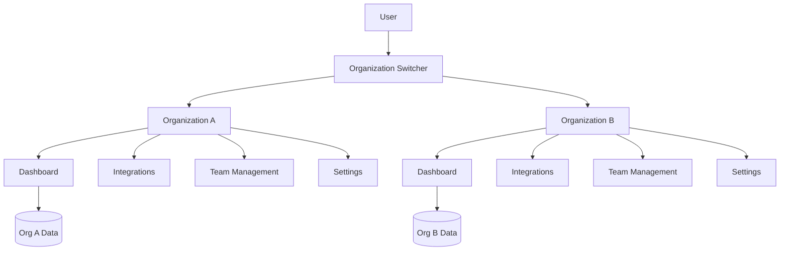
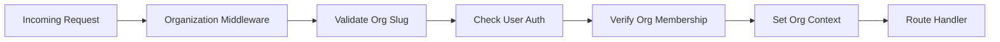

# Multi-Tenant Organizations Design Document

## Overview

This design implements organization-based multi-tenancy for UnifiedHQ, transforming the current single-tenant architecture into a scalable multi-tenant system. Each organization acts as an isolated tenant with complete data separation, role-based access control, and independent billing/subscription management.

The design follows a shared database, separate schema approach where all data is logically partitioned by `organizationId` with row-level security enforcement at the database level.

## Architecture

### High-Level Architecture



### URL Structure

The application will use organization slugs in the URL path to provide clean, bookmarkable URLs:

- `/[orgSlug]/dashboard` - Organization dashboard
- `/[orgSlug]/integrations` - Integration management
- `/[orgSlug]/team` - Team member management
- `/[orgSlug]/settings` - Organization settings
- `/[orgSlug]/ai-insights` - AI-powered insights
- `/[orgSlug]/summary-history` - Activity summaries

### Middleware Architecture



## Components and Interfaces

### Database Schema Changes

#### New Tables

**Organization Table**
```typescript
model Organization {
  id        String   @id @default(cuid())
  name      String
  slug      String   @unique
  plan      Plan     @default(FREE)
  createdAt DateTime @default(now())
  updatedAt DateTime @updatedAt
  
  // Relationships
  members      OrganizationMember[]
  connections  Connection[]
  activities   Activity[]
  // ... other organization-scoped models
}

enum Plan {
  FREE
  PRO
  ENTERPRISE
}
```

**OrganizationMember Table**
```typescript
model OrganizationMember {
  id             String   @id @default(cuid())
  organizationId String
  userId         String
  role           Role     @default(MEMBER)
  invitedBy      String?
  joinedAt       DateTime @default(now())
  invitedAt      DateTime @default(now())
  status         MemberStatus @default(ACTIVE)
  
  // Relationships
  organization Organization @relation(fields: [organizationId], references: [id], onDelete: Cascade)
  user         User         @relation(fields: [userId], references: [id], onDelete: Cascade)
  inviter      User?        @relation("InvitedBy", fields: [invitedBy], references: [id])
  
  @@unique([organizationId, userId])
}

enum Role {
  OWNER
  ADMIN
  MEMBER
  VIEWER
}

enum MemberStatus {
  PENDING
  ACTIVE
  SUSPENDED
}
```

**OrganizationInvitation Table**
```typescript
model OrganizationInvitation {
  id             String   @id @default(cuid())
  organizationId String
  email          String
  role           Role     @default(MEMBER)
  token          String   @unique
  invitedBy      String
  expiresAt      DateTime
  acceptedAt     DateTime?
  createdAt      DateTime @default(now())
  
  // Relationships
  organization Organization @relation(fields: [organizationId], references: [id], onDelete: Cascade)
  inviter      User         @relation(fields: [invitedBy], references: [id])
}
```

#### Modified Tables

**User Table Updates**
```typescript
model User {
  // ... existing fields
  currentOrganizationId String?
  
  // New relationships
  organizationMembers   OrganizationMember[]
  currentOrganization   Organization? @relation("CurrentOrg", fields: [currentOrganizationId], references: [id])
  sentInvitations       OrganizationInvitation[]
}
```

**Organization-Scoped Models**
All existing models that store user data will be updated to include `organizationId`:

```typescript
model Activity {
  // ... existing fields
  organizationId String
  organization   Organization @relation(fields: [organizationId], references: [id], onDelete: Cascade)
  
  @@unique([organizationId, userId, source, externalId])
}

model Connection {
  // ... existing fields
  organizationId String
  organization   Organization @relation(fields: [organizationId], references: [id], onDelete: Cascade)
  
  @@unique([organizationId, userId, type])
}

// Similar updates for: SelectedRepository, SelectedChannel, GitHubCache, SlackCache, AISummary, UserPreferences
```

### Core Services

#### OrganizationService
```typescript
interface OrganizationService {
  // Organization management
  createOrganization(data: CreateOrganizationData): Promise<Organization>
  getOrganizationBySlug(slug: string): Promise<Organization | null>
  updateOrganization(id: string, data: UpdateOrganizationData): Promise<Organization>
  deleteOrganization(id: string): Promise<void>
  
  // Member management
  inviteMember(organizationId: string, email: string, role: Role, invitedBy: string): Promise<OrganizationInvitation>
  acceptInvitation(token: string, userId: string): Promise<OrganizationMember>
  updateMemberRole(organizationId: string, userId: string, role: Role): Promise<OrganizationMember>
  removeMember(organizationId: string, userId: string): Promise<void>
  
  // Membership queries
  getUserOrganizations(userId: string): Promise<Organization[]>
  getOrganizationMembers(organizationId: string): Promise<OrganizationMember[]>
  checkMembership(organizationId: string, userId: string): Promise<OrganizationMember | null>
}
```

#### PermissionService
```typescript
interface PermissionService {
  hasPermission(userId: string, organizationId: string, permission: Permission): Promise<boolean>
  getUserRole(userId: string, organizationId: string): Promise<Role | null>
  canAccessOrganization(userId: string, organizationId: string): Promise<boolean>
}

enum Permission {
  // Organization management
  'org.settings.update',
  'org.delete',
  'org.billing.manage',
  
  // Team management
  'team.invite',
  'team.remove',
  'team.role.update',
  
  // Integration management
  'integrations.manage',
  'integrations.view',
  
  // Dashboard access
  'dashboard.view',
  'activities.view',
  'ai-insights.view'
}
```

### Middleware Components

#### Organization Context Middleware
```typescript
// src/middleware/organization.ts
export async function withOrganization(request: NextRequest) {
  const pathname = request.nextUrl.pathname;
  const orgSlug = pathname.split('/')[1];
  
  // Skip middleware for non-org routes
  if (!orgSlug || isPublicRoute(pathname)) {
    return NextResponse.next();
  }
  
  // Validate organization
  const organization = await getOrganizationBySlug(orgSlug);
  if (!organization) {
    return NextResponse.redirect(new URL('/not-found', request.url));
  }
  
  // Check user authentication
  const session = await getSession(request);
  if (!session?.user) {
    return NextResponse.redirect(new URL('/auth/signin', request.url));
  }
  
  // Verify organization membership
  const membership = await checkMembership(organization.id, session.user.id);
  if (!membership) {
    return NextResponse.redirect(new URL('/unauthorized', request.url));
  }
  
  // Add organization context to request
  const requestHeaders = new Headers(request.headers);
  requestHeaders.set('x-organization-id', organization.id);
  requestHeaders.set('x-organization-slug', organization.slug);
  requestHeaders.set('x-user-role', membership.role);
  
  return NextResponse.next({
    request: {
      headers: requestHeaders,
    },
  });
}
```

#### Database Query Middleware
```typescript
// src/lib/prisma-middleware.ts
export function createTenantMiddleware() {
  return Prisma.middleware(async (params, next) => {
    // Get organization context from request headers or context
    const organizationId = getOrganizationContext();
    
    if (!organizationId) {
      throw new Error('Organization context required');
    }
    
    // Add organizationId filter to all queries for tenant-scoped models
    if (isTenantScopedModel(params.model)) {
      if (params.action === 'findMany' || params.action === 'findFirst') {
        params.args.where = {
          ...params.args.where,
          organizationId,
        };
      } else if (params.action === 'create') {
        params.args.data = {
          ...params.args.data,
          organizationId,
        };
      }
    }
    
    return next(params);
  });
}
```

## Data Models

### Organization Context Provider
```typescript
// src/contexts/organization-context.tsx
interface OrganizationContextType {
  organization: Organization | null;
  userRole: Role | null;
  switchOrganization: (orgSlug: string) => Promise<void>;
  userOrganizations: Organization[];
  isLoading: boolean;
}

export const OrganizationContext = createContext<OrganizationContextType | null>(null);

export function OrganizationProvider({ children }: { children: React.ReactNode }) {
  // Implementation with organization state management
}
```

### Permission Hook
```typescript
// src/hooks/use-permissions.ts
export function usePermissions() {
  const { organization, userRole } = useOrganization();
  
  const hasPermission = useCallback((permission: Permission) => {
    return checkRolePermission(userRole, permission);
  }, [userRole]);
  
  const canManageTeam = hasPermission('team.invite');
  const canManageIntegrations = hasPermission('integrations.manage');
  const canManageSettings = hasPermission('org.settings.update');
  
  return {
    hasPermission,
    canManageTeam,
    canManageIntegrations,
    canManageSettings,
  };
}
```

## Error Handling

### Organization-Specific Error Types
```typescript
export class OrganizationError extends Error {
  constructor(
    message: string,
    public code: 'NOT_FOUND' | 'ACCESS_DENIED' | 'INVALID_SLUG' | 'MEMBER_EXISTS',
    public organizationId?: string
  ) {
    super(message);
    this.name = 'OrganizationError';
  }
}

export class PermissionError extends Error {
  constructor(
    message: string,
    public requiredPermission: Permission,
    public userRole: Role
  ) {
    super(message);
    this.name = 'PermissionError';
  }
}
```

### Error Boundary Component
```typescript
// src/components/organization-error-boundary.tsx
export function OrganizationErrorBoundary({ children }: { children: React.ReactNode }) {
  return (
    <ErrorBoundary
      fallback={({ error }) => {
        if (error instanceof OrganizationError) {
          return <OrganizationNotFound />;
        }
        if (error instanceof PermissionError) {
          return <UnauthorizedAccess requiredRole={error.requiredPermission} />;
        }
        return <GenericError />;
      }}
    >
      {children}
    </ErrorBoundary>
  );
}
```

## Testing Strategy

### Unit Testing
- **Service Layer Tests**: Test organization and permission services with mocked database
- **Middleware Tests**: Test organization context and permission middleware with mock requests
- **Hook Tests**: Test React hooks for organization management and permissions
- **Utility Tests**: Test slug generation, permission checking, and data transformation utilities

### Integration Testing
- **API Route Tests**: Test organization-scoped API endpoints with different user roles
- **Database Tests**: Test tenant isolation and data filtering with real database
- **Authentication Flow Tests**: Test organization switching and invitation acceptance
- **Migration Tests**: Test data migration from single-tenant to multi-tenant structure

### End-to-End Testing
- **Organization Creation Flow**: Test complete organization setup process
- **Team Invitation Flow**: Test invitation sending, acceptance, and role assignment
- **Organization Switching**: Test seamless switching between organizations
- **Permission Enforcement**: Test role-based access control across different features

### Performance Testing
- **Query Performance**: Ensure organization filtering doesn't impact query performance
- **Concurrent Access**: Test multiple organizations accessing the system simultaneously
- **Memory Usage**: Monitor memory consumption with organization context switching
- **Cache Efficiency**: Test organization-scoped caching strategies

## Migration Strategy

### Phase 1: Database Schema Migration
1. **Add Organization Tables**: Create Organization, OrganizationMember, and OrganizationInvitation tables
2. **Update User Table**: Add currentOrganizationId field
3. **Create Personal Organizations**: Generate personal organizations for all existing users
4. **Add Organization Foreign Keys**: Add organizationId to all tenant-scoped tables

### Phase 2: Data Migration
1. **Migrate User Data**: Associate existing user data with their personal organizations
2. **Update Connections**: Scope existing integrations to personal organizations
3. **Migrate Activities**: Associate existing activities with personal organizations
4. **Update Preferences**: Scope user preferences to organizations

### Phase 3: Application Updates
1. **Implement Middleware**: Add organization context and permission middleware
2. **Update API Routes**: Add organization filtering to all endpoints
3. **Modify UI Components**: Add organization switcher and update navigation
4. **Update Authentication**: Integrate organization context with Better Auth

### Phase 4: Feature Rollout
1. **Team Invitations**: Enable team invitation system
2. **Organization Management**: Add organization settings and management features
3. **Billing Integration**: Implement organization-level subscription management
4. **Advanced Features**: Add organization switching and multi-org support

## Security Considerations

### Row-Level Security (RLS)
```sql
-- Enable RLS on tenant-scoped tables
ALTER TABLE activities ENABLE ROW LEVEL SECURITY;

-- Create policy for organization-scoped access
CREATE POLICY activities_organization_policy ON activities
  USING (organization_id = current_setting('app.current_organization_id'));
```

### API Security
- **Organization Context Validation**: Every API request validates organization membership
- **Permission Middleware**: Role-based access control on all endpoints
- **Data Filtering**: Automatic organization filtering on all database queries
- **Audit Logging**: Track all organization-level actions for security monitoring

### Authentication Integration
- **Session Enhancement**: Include current organization in user session
- **Token Validation**: Validate organization access on every authenticated request
- **Cross-Organization Prevention**: Prevent accidental data leakage between organizations
- **Invitation Security**: Secure token-based invitation system with expiration