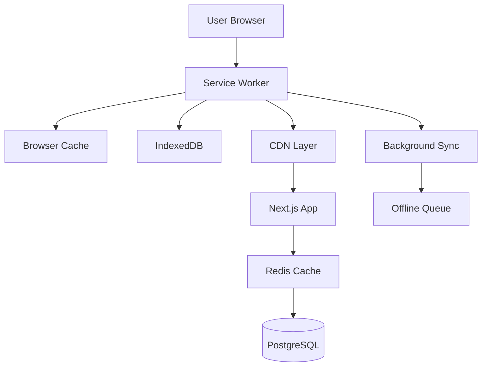

# Design Document

## Overview

The offline infrastructure feature implements a comprehensive caching and offline-first architecture for UnifiedHQ. The design leverages service workers for client-side caching, Redis for server-side caching, CDN integration for static asset delivery, and background sync for offline data synchronization. This multi-layered approach ensures optimal performance and user experience across all network conditions.

## Architecture

### High-Level Architecture



### Caching Layers

1. **Browser Cache**: Static assets with long-term caching
2. **Service Worker Cache**: Application shell and API responses
3. **IndexedDB**: Structured data and offline queue
4. **Redis Cache**: Server-side API response caching
5. **CDN Cache**: Global static asset distribution

## Components and Interfaces

### Service Worker Implementation

**Location**: `public/sw.js` and `src/lib/service-worker/`

**Core Components**:
- **Cache Manager**: Handles different caching strategies per content type
- **Offline Detector**: Monitors network status and updates UI
- **Background Sync Handler**: Manages offline action queuing and synchronization
- **Update Manager**: Handles service worker updates and cache versioning

**Caching Strategies**:
- **Cache First**: Static assets (images, fonts, CSS)
- **Network First**: API responses with fallback to cache
- **Stale While Revalidate**: Dashboard data and user preferences
- **Cache Only**: Offline pages and error fallbacks

### Redis Caching Layer

**Location**: `src/lib/cache/redis.ts`

**Components**:
- **Redis Client**: Connection management with clustering support
- **Cache Key Generator**: Consistent key naming with namespacing
- **TTL Manager**: Dynamic expiration based on data type
- **Invalidation Service**: Smart cache invalidation for related data

**Cache Categories**:
- **User Sessions**: 24-hour TTL
- **GitHub Data**: 15-minute TTL with background refresh
- **Slack Data**: 5-minute TTL for real-time feel
- **AI Summaries**: 1-hour TTL with manual invalidation
- **Static Configuration**: 24-hour TTL

### CDN Integration

**Implementation**: Vercel Edge Network integration with custom configuration

**Components**:
- **Asset Optimization**: Automatic WebP/AVIF conversion
- **Cache Headers**: Intelligent cache control based on content type
- **Purge API**: Programmatic cache invalidation
- **Geographic Routing**: Optimal edge server selection

### Background Sync System

**Location**: `src/lib/offline/background-sync.ts`

**Components**:
- **Action Queue**: IndexedDB-based persistent storage
- **Sync Manager**: Handles retry logic and conflict resolution
- **Conflict Resolver**: Merges offline changes with server state
- **Progress Tracker**: User feedback for sync operations

## Data Models

### Cache Entry Model

```typescript
interface CacheEntry {
  key: string;
  data: any;
  timestamp: number;
  ttl: number;
  version: string;
  tags: string[];
}
```

### Offline Action Model

```typescript
interface OfflineAction {
  id: string;
  type: 'CREATE' | 'UPDATE' | 'DELETE';
  resource: string;
  payload: any;
  timestamp: number;
  retryCount: number;
  status: 'PENDING' | 'SYNCING' | 'COMPLETED' | 'FAILED';
}
```

### Cache Configuration Model

```typescript
interface CacheConfig {
  strategy: 'cache-first' | 'network-first' | 'stale-while-revalidate';
  ttl: number;
  maxEntries: number;
  updateInterval?: number;
  tags: string[];
}
```

## Error Handling

### Service Worker Error Handling

- **Registration Failures**: Graceful degradation without offline features
- **Cache Errors**: Fallback to network requests with user notification
- **Sync Failures**: Exponential backoff with user-visible retry options
- **Version Conflicts**: Automatic service worker updates with user consent

### Redis Error Handling

- **Connection Failures**: Automatic failover to direct database queries
- **Memory Limits**: LRU eviction with priority-based retention
- **Cluster Failures**: Graceful degradation with performance monitoring
- **Data Corruption**: Automatic cache invalidation and rebuild

### CDN Error Handling

- **Edge Server Failures**: Automatic failover to origin server
- **Purge Failures**: Retry mechanism with manual override options
- **Geographic Routing Issues**: Fallback to nearest available edge

## Testing Strategy

### Service Worker Testing

- **Unit Tests**: Cache strategies and offline detection logic
- **Integration Tests**: End-to-end offline scenarios with Playwright
- **Performance Tests**: Cache hit rates and response time measurements
- **Browser Compatibility**: Cross-browser service worker functionality

### Redis Testing

- **Unit Tests**: Cache operations and TTL management
- **Load Tests**: Concurrent access patterns and memory usage
- **Failover Tests**: Redis cluster failure scenarios
- **Performance Tests**: Cache hit rates and response time impact

### CDN Testing

- **Geographic Tests**: Asset delivery from multiple locations
- **Performance Tests**: Load time improvements and cache effectiveness
- **Failover Tests**: CDN unavailability scenarios
- **Purge Tests**: Cache invalidation timing and effectiveness

### Background Sync Testing

- **Offline Simulation**: Network disconnection and reconnection scenarios
- **Conflict Resolution**: Concurrent modification handling
- **Data Integrity**: Ensuring no data loss during sync operations
- **Performance Tests**: Sync queue processing under load

## Performance Considerations

### Cache Optimization

- **Intelligent Prefetching**: Predictive caching based on user patterns
- **Compression**: Gzip/Brotli compression for cached responses
- **Memory Management**: Automatic cleanup of expired entries
- **Storage Quotas**: Respectful use of browser storage limits

### Network Optimization

- **Request Batching**: Combining multiple API calls during sync
- **Differential Sync**: Only syncing changed data portions
- **Priority Queuing**: Critical actions processed first
- **Bandwidth Detection**: Adaptive sync strategies based on connection quality

## Security Considerations

### Service Worker Security

- **Origin Validation**: Strict same-origin policy enforcement
- **Content Security Policy**: CSP headers for service worker scripts
- **Cache Poisoning Prevention**: Integrity checks for cached content
- **Update Security**: Signed service worker updates

### Redis Security

- **Authentication**: Redis AUTH with strong passwords
- **Encryption**: TLS encryption for Redis connections
- **Access Control**: Role-based access to cache operations
- **Data Sanitization**: Input validation for cache keys and values

### CDN Security

- **HTTPS Enforcement**: All CDN traffic over secure connections
- **Access Control**: Signed URLs for sensitive assets
- **DDoS Protection**: Built-in CDN DDoS mitigation
- **Content Validation**: Integrity checks for served assets