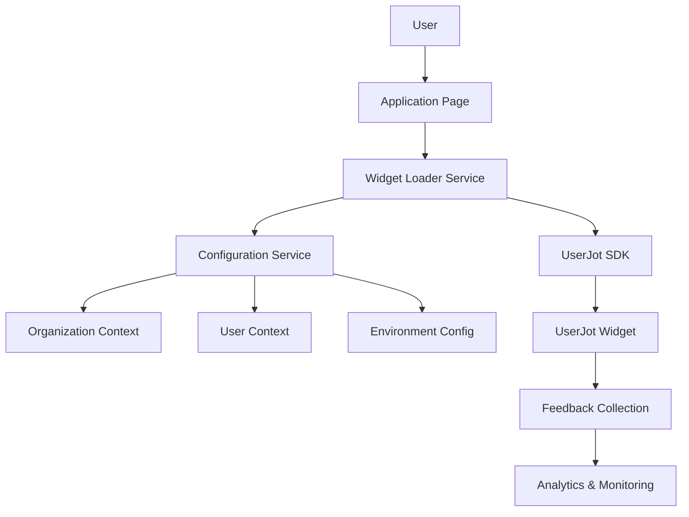
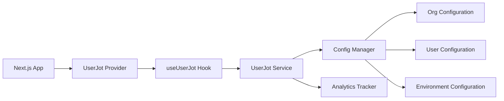

# UserJot Widget Integration Design Document

## Overview

This design implements the UserJot feedback widget integration into UnifiedHQ, providing a seamless user feedback collection system that respects the multi-tenant architecture. The integration will be organization-aware, privacy-compliant, and configurable across different environments and user segments.

The widget will be loaded asynchronously using the UserJot SDK and configured dynamically based on organization context, user roles, and environment settings.

## Architecture

### High-Level Integration Flow



### Component Architecture



## Components and Interfaces

### Core Services

#### UserJotService
```typescript
interface UserJotService {
  // Widget lifecycle
  initialize(config: UserJotConfig): Promise<void>
  destroy(): Promise<void>
  reload(newConfig: UserJotConfig): Promise<void>
  
  // Configuration management
  getConfiguration(): UserJotConfig
  updateConfiguration(updates: Partial<UserJotConfig>): Promise<void>
  
  // Analytics and monitoring
  trackEvent(event: UserJotEvent): void
  getAnalytics(): UserJotAnalytics
  
  // Privacy and consent
  setConsentStatus(hasConsent: boolean): void
  anonymizeUser(): void
}

interface UserJotConfig {
  projectId: string
  widget: {
    enabled: boolean
    position: 'right' | 'left' | 'bottom' | 'top'
    theme: 'auto' | 'light' | 'dark'
    customStyles?: Record<string, string>
  }
  organization: {
    id: string
    name: string
    slug: string
  }
  user: {
    id?: string
    role?: string
    segment?: string
    anonymous: boolean
  }
  privacy: {
    consentRequired: boolean
    anonymizeData: boolean
    gdprCompliant: boolean
  }
  environment: {
    name: 'development' | 'staging' | 'production'
    debug: boolean
  }
}
```

#### ConfigurationManager
```typescript
interface ConfigurationManager {
  // Environment-based configuration
  getEnvironmentConfig(): EnvironmentConfig
  
  // Organization-specific configuration
  getOrganizationConfig(organizationId: string): OrganizationConfig
  
  // User-specific configuration
  getUserConfig(userId: string, organizationId: string): UserConfig
  
  // Merged configuration
  buildConfiguration(context: ConfigurationContext): UserJotConfig
  
  // Configuration validation
  validateConfiguration(config: UserJotConfig): ValidationResult
}

interface ConfigurationContext {
  organizationId: string
  userId?: string
  userRole?: string
  environment: string
  consentStatus?: boolean
}
```

### React Components and Hooks

#### UserJot Provider
```typescript
// src/components/providers/userjot-provider.tsx
interface UserJotProviderProps {
  children: React.ReactNode
  config?: Partial<UserJotConfig>
}

export function UserJotProvider({ children, config }: UserJotProviderProps) {
  // Provider implementation with context management
}

interface UserJotContextType {
  isLoaded: boolean
  isEnabled: boolean
  config: UserJotConfig | null
  error: Error | null
  
  // Actions
  reload: () => Promise<void>
  updateConfig: (updates: Partial<UserJotConfig>) => Promise<void>
  trackEvent: (event: UserJotEvent) => void
}
```

#### UserJot Hook
```typescript
// src/hooks/use-userjot.ts
export function useUserJot() {
  const context = useContext(UserJotContext)
  
  const showWidget = useCallback(() => {
    // Show widget implementation
  }, [])
  
  const hideWidget = useCallback(() => {
    // Hide widget implementation
  }, [])
  
  const triggerSurvey = useCallback((surveyId: string) => {
    // Trigger specific survey
  }, [])
  
  return {
    ...context,
    showWidget,
    hideWidget,
    triggerSurvey,
  }
}
```

### Configuration Schema

#### Environment Configuration
```typescript
// src/config/userjot.ts
interface EnvironmentConfig {
  development: {
    projectId: string
    enabled: boolean
    debug: true
    widget: {
      position: 'right'
      theme: 'auto'
    }
  }
  staging: {
    projectId: string
    enabled: boolean
    debug: true
    widget: {
      position: 'right'
      theme: 'auto'
    }
  }
  production: {
    projectId: string
    enabled: boolean
    debug: false
    widget: {
      position: 'right'
      theme: 'auto'
    }
  }
}
```

#### Database Schema Extensions
```typescript
// Add to existing Prisma schema
model OrganizationSettings {
  id             String @id @default(cuid())
  organizationId String
  organization   Organization @relation(fields: [organizationId], references: [id], onDelete: Cascade)
  
  // UserJot configuration
  userJotEnabled    Boolean @default(true)
  userJotProjectId  String?
  userJotConfig     Json?   // Widget customization
  
  createdAt DateTime @default(now())
  updatedAt DateTime @updatedAt
  
  @@unique([organizationId])
}

model UserFeedbackPreferences {
  id     String @id @default(cuid())
  userId String
  user   User   @relation(fields: [userId], references: [id], onDelete: Cascade)
  
  // Feedback preferences
  allowFeedbackCollection Boolean @default(true)
  anonymizeFeedbackData   Boolean @default(false)
  feedbackConsentGiven    Boolean @default(false)
  
  createdAt DateTime @default(now())
  updatedAt DateTime @updatedAt
  
  @@unique([userId])
}
```

## Data Models

### Widget Loading Strategy

#### Async Script Loader
```typescript
// src/lib/userjot/script-loader.ts
export class UserJotScriptLoader {
  private static instance: UserJotScriptLoader
  private isLoaded = false
  private isLoading = false
  private loadPromise: Promise<void> | null = null
  
  static getInstance(): UserJotScriptLoader {
    if (!this.instance) {
      this.instance = new UserJotScriptLoader()
    }
    return this.instance
  }
  
  async loadScript(): Promise<void> {
    if (this.isLoaded) return
    if (this.isLoading) return this.loadPromise!
    
    this.isLoading = true
    this.loadPromise = this.createScriptElement()
    
    try {
      await this.loadPromise
      this.isLoaded = true
    } finally {
      this.isLoading = false
    }
  }
  
  private createScriptElement(): Promise<void> {
    return new Promise((resolve, reject) => {
      const script = document.createElement('script')
      script.src = 'https://widget.userjot.com/sdk.js' // UserJot SDK URL
      script.async = true
      script.onload = () => resolve()
      script.onerror = () => reject(new Error('Failed to load UserJot SDK'))
      document.head.appendChild(script)
    })
  }
}
```

### Analytics and Monitoring

#### Event Tracking
```typescript
interface UserJotEvent {
  type: 'widget_loaded' | 'widget_shown' | 'widget_hidden' | 'feedback_submitted' | 'survey_completed'
  timestamp: Date
  organizationId: string
  userId?: string
  metadata?: Record<string, any>
}

interface UserJotAnalytics {
  loadTime: number
  errorRate: number
  engagementRate: number
  feedbackCount: number
  surveyCompletionRate: number
}
```

#### Performance Monitoring
```typescript
// src/lib/userjot/performance-monitor.ts
export class UserJotPerformanceMonitor {
  private metrics: Map<string, number> = new Map()
  
  startTiming(key: string): void {
    this.metrics.set(`${key}_start`, performance.now())
  }
  
  endTiming(key: string): number {
    const startTime = this.metrics.get(`${key}_start`)
    if (!startTime) return 0
    
    const duration = performance.now() - startTime
    this.metrics.set(key, duration)
    return duration
  }
  
  getMetrics(): Record<string, number> {
    return Object.fromEntries(this.metrics)
  }
  
  reportMetrics(): void {
    // Send metrics to analytics service
  }
}
```

## Error Handling

### Error Types and Recovery

```typescript
export class UserJotError extends Error {
  constructor(
    message: string,
    public code: 'SCRIPT_LOAD_FAILED' | 'INITIALIZATION_FAILED' | 'CONFIG_INVALID' | 'NETWORK_ERROR',
    public recoverable: boolean = true
  ) {
    super(message)
    this.name = 'UserJotError'
  }
}

export class UserJotErrorHandler {
  private retryCount = 0
  private maxRetries = 3
  
  async handleError(error: UserJotError): Promise<void> {
    console.error('UserJot Error:', error)
    
    // Send error to monitoring service
    this.reportError(error)
    
    // Attempt recovery for recoverable errors
    if (error.recoverable && this.retryCount < this.maxRetries) {
      this.retryCount++
      await this.attemptRecovery(error)
    }
  }
  
  private async attemptRecovery(error: UserJotError): Promise<void> {
    switch (error.code) {
      case 'SCRIPT_LOAD_FAILED':
        // Retry script loading
        break
      case 'INITIALIZATION_FAILED':
        // Retry initialization with fallback config
        break
      default:
        // Generic recovery
        break
    }
  }
  
  private reportError(error: UserJotError): void {
    // Report to Sentry or other error tracking service
  }
}
```

## Testing Strategy

### Unit Testing
- **Script Loader Tests**: Test async script loading with success and failure scenarios
- **Configuration Manager Tests**: Test configuration merging and validation logic
- **Hook Tests**: Test React hooks for widget management and state updates
- **Service Tests**: Test UserJot service methods with mocked SDK

### Integration Testing
- **Widget Loading Tests**: Test complete widget loading flow in browser environment
- **Configuration Tests**: Test configuration loading from different sources
- **Organization Context Tests**: Test widget behavior with different organization contexts
- **Privacy Tests**: Test consent management and data anonymization

### End-to-End Testing
- **Widget Interaction Tests**: Test user interactions with the loaded widget
- **Feedback Flow Tests**: Test complete feedback submission process
- **Multi-Organization Tests**: Test widget behavior when switching organizations
- **Performance Tests**: Test widget impact on page load and runtime performance

### Performance Testing
- **Load Time Impact**: Measure widget loading impact on page performance
- **Memory Usage**: Monitor memory consumption of widget integration
- **Network Impact**: Test widget's network usage and caching behavior
- **Error Recovery**: Test error handling and recovery mechanisms

## Security Considerations

### Content Security Policy (CSP)
```typescript
// Update CSP headers to allow UserJot resources
const cspDirectives = {
  'script-src': [
    "'self'",
    "'unsafe-inline'",
    'https://widget.userjot.com',
  ],
  'connect-src': [
    "'self'",
    'https://api.userjot.com',
  ],
  'frame-src': [
    'https://widget.userjot.com',
  ],
}
```

### Data Privacy and GDPR Compliance
- **Consent Management**: Implement proper consent collection before widget initialization
- **Data Minimization**: Only collect necessary user data for feedback purposes
- **Right to Deletion**: Provide mechanisms to delete user feedback data
- **Data Processing Agreements**: Ensure proper DPA with UserJot for data processing

### Organization Data Isolation
- **Context Validation**: Ensure widget only accesses data from current organization
- **Metadata Filtering**: Filter organization-specific metadata in widget configuration
- **Cross-Organization Prevention**: Prevent data leakage between organizations

## Integration Points

### Next.js App Integration
```typescript
// src/app/layout.tsx - Root layout integration
import { UserJotProvider } from '@/components/providers/userjot-provider'

export default function RootLayout({ children }: { children: React.ReactNode }) {
  return (
    <html>
      <body>
        <UserJotProvider>
          {children}
        </UserJotProvider>
      </body>
    </html>
  )
}
```

### Organization-Scoped Integration
```typescript
// src/app/[orgSlug]/layout.tsx - Organization layout integration
import { useOrganization } from '@/contexts/organization-context'
import { useUserJot } from '@/hooks/use-userjot'

export default function OrganizationLayout({ children }: { children: React.ReactNode }) {
  const { organization } = useOrganization()
  const { updateConfig } = useUserJot()
  
  useEffect(() => {
    if (organization) {
      updateConfig({
        organization: {
          id: organization.id,
          name: organization.name,
          slug: organization.slug,
        },
      })
    }
  }, [organization, updateConfig])
  
  return <>{children}</>
}
```

### API Integration
```typescript
// src/app/api/userjot/config/route.ts - Configuration API
export async function GET(request: NextRequest) {
  const organizationId = request.headers.get('x-organization-id')
  const userId = request.headers.get('x-user-id')
  
  const config = await configurationManager.buildConfiguration({
    organizationId,
    userId,
    environment: process.env.NODE_ENV,
  })
  
  return Response.json(config)
}
```